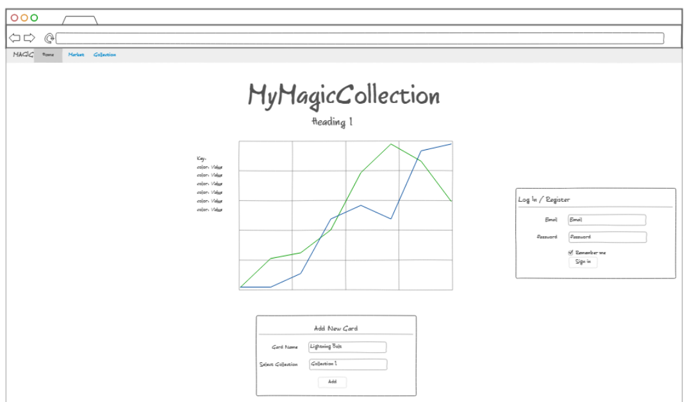

MyMagicCollection.com Elevator speech.

Introducing MyMagicCollection.com, your ultimate companion for organizing and managing your magic card collection! Features include catalogueing, sorting, and tracking market trends on the secondary market. This website is especially for people who want to track single cards or a collection long term.  It will keep its users up to date on price changes on wishlist cards so that they can buy them when they dip in price.

Key Features:
track cards like a stock market watcher website watches the stock market
Keep track of average market value of a set of cards, like a collection
keeps this data on a database connected to a user account for easy access to the watchlists

How I will implement these features:
Allow user to create lists of cards
Look up current prices for those cards and store them
Allow for user to check prices again at any time, also updating the graph and other visuals/representations of secondary value changes

Technologies:
some library that grabs prices from popular 2ndary market for Magic cards, preferably TCGPlayer.com
Line Graphs that, when updated, show the change in value for the cards over time

# MyMagicCollection.com Elevator Speech

Introducing [MyMagicCollection.com](https://www.mymagiccollection.com), your ultimate companion for organizing and managing your magic card collection! Features include catalogueing, sorting, and tracking market trends on the secondary market. This website is especially for people who want to track single cards or a collection long term.  It will keep its users up to date on price changes on wishlist cards so that they can buy them when they dip in price.

## Key Features:

- **Track Cards You Want To Buy:**
  View a selection of card's value with a stock market watcher-like approach. Monitor price changes for wishlist cards and watch for buying opportunities when prices dip.  Or buy when prices are rising to not miss out!

- **Track your collection:**
  Keep tabs on the average market value of your cards.  This website functions as a portfolio showcasing the value of your collection, and how it changes over time.

- **Database:**
  The cards, sorted into collections such as watchlists and personally owned collection, are stored on a database connected to a user account.

## Implementation:

1. **Create Custom Lists:**
   Empower users to create personalized lists of cards.

2. **Real-time Price Lookup:**
   Use a library that fetches prices from popular secondary markets, such as [TCGPlayer.com](https://www.tcgplayer.com).

3. **Visualization of Price:**
   Watch as line graphs update, visually representing changes in card values over time. Will also consider other options of visually displaying price changes.

## Technologies:

- **Price Data Retrieval:**
  Find a library for fetching prices from secondary markets.  Implement it into website so when user clicks update data, it grabs and stores the new price. 

- **Visual Representation:**
  Implement line graphs to show price changes

- **Store price changes**
  Also store older prices at certain dates for cards to show the user how things have changed over time.

  ## Photos:
  
  
